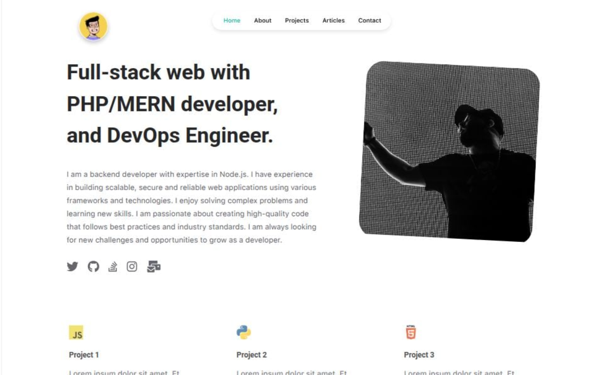

# 🧑‍💻 Personal Portfolio Website (React + Vite + React Router)

🚀 **Live Demo:** [https://portfolio-website-sepia-psi.vercel.app](https://portfolio-website-sepia-psi.vercel.app)



This is a modern, fully responsive **developer portfolio website** built using **React**, **Vite**, and **React Router DOM**. It showcases your profile, projects, articles, and contact information—along with support for Google Analytics, SEO optimization, and dynamic routing for blog/article reading.

---

## 🚀 Features

- ⚛️ **Built with React & Vite** for lightning-fast performance
- 📄 **7 Pages**: Home, About, Projects, Articles, Detailed Article View, Contact, and 404 Not Found
- 🧭 **React Router DOM** for dynamic client-side routing
- 📊 **Google Analytics 4** integration (via `react-ga4`)
- 🧠 **SEO optimization** using `react-helmet-async`
- 📰 Dynamic blog/article rendering from a data source
- 📦 Modular components for scalability and reusability
- 🎨 FontAwesome Icons & social links included
- ✅ Fully responsive and mobile-friendly design

---

## 📄 Pages Overview

| Path           | Component         | Description                              |
|----------------|-------------------|------------------------------------------|
| `/`            | `Home.jsx`        | Landing page with intro and highlights   |
| `/about`       | `About.jsx`       | Bio, skills, and personal story          |
| `/projects`    | `Projects.jsx`    | Portfolio of completed work              |
| `/articles`    | `Articles.jsx`    | Blog listing from `articles.jsx` data    |
| `/article/:id` | `ReadArticle.jsx` | Dynamic article detail page              |
| `/contact`     | `Contact.jsx`     | Contact form or information              |
| `*`            | `NotFound.jsx`    | 404 fallback page                        |

---

## 📁 Project Structure

```txt
src/
├── App.jsx                  # Main routing setup
├── App.css                  # Global styling

├── pages/                   # Page-level components
│   ├── Home/
│   ├── About/
│   ├── Projects/
│   ├── Articles/
│   ├── ReadArticle/
│   ├── Contact/
│   └── NotFound/

├── components/              # Reusable UI components
│   ├── AllProjects.jsx
│   ├── Article.jsx
│   ├── Card.jsx
│   ├── Footer.jsx
│   ├── NavBar.jsx
│   ├── Project.jsx
│   ├── Socials.jsx
│   └── Works.jsx

├── data/                    # Static & configuration files
│   ├── articles.jsx         # Blog/article content as functions
│   ├── info.js              # Developer details & bio
│   ├── seo.js               # SEO meta info for each route
│   └── tracking.js          # GA4 tracking ID

├── public/                  # Static assets
```

---

## 📦 Installed Packages

```bash

npm install react-router-dom
npm install react-ga4
npm install react-helmet-async
npm install @fortawesome/react-fontawesome @fortawesome/fontawesome-svg-core
npm install @fortawesome/free-solid-svg-icons @fortawesome/free-regular-svg-icons @fortawesome/free-brands-svg-icons
```

---

## 🧠 Usage Guide

### 1. Run Locally

```bash

npm install
npm run dev
```

Open your browser at: http://localhost:5173

### 2. Add Google Analytics (Optional)
- Set your GA4 tracking ID inside data/tracking.js
```js
export const TRACKING_ID = "G-XXXXXXXXXX"; // Replace with real ID
```

- Uncomment the `useEffect` block in App.jsx to activate it.

---

## ✨ SEO with Helmet
Each page (especially article detail pages) uses react-helmet-async to inject SEO metadata like title, description, and keywords dynamically.

Wrap your app with:

```jsx
import { HelmetProvider } from 'react-helmet-async';

<HelmetProvider>
  <App />
</HelmetProvider>
```

Then in components:
```jsx
import { Helmet } from 'react-helmet-async';

<Helmet>
  <title>{article.title}</title>
  <meta name="description" content={article.description} />
</Helmet>
```

---

## 🌐 FontAwesome Icons
Icons are added from FontAwesome via:

```jsx
import { FontAwesomeIcon } from "@fortawesome/react-fontawesome";
<FontAwesomeIcon icon={["fab", "github"]} />

```

You can customize them in `Socials.jsx`, `Footer.jsx`, etc.

## 🙋 Author

Surender Gupta
💼 PHP / MERN / DevOps Engineer
🔗 [LinkedIn](https://www.linkedin.com/in/surender-gupta/)
📧 [gupta.surender.1990@gmail.com](mailto:gupta.surender.1990@gmail.com)

---


## 📄 License
This project is licensed under the MIT License.